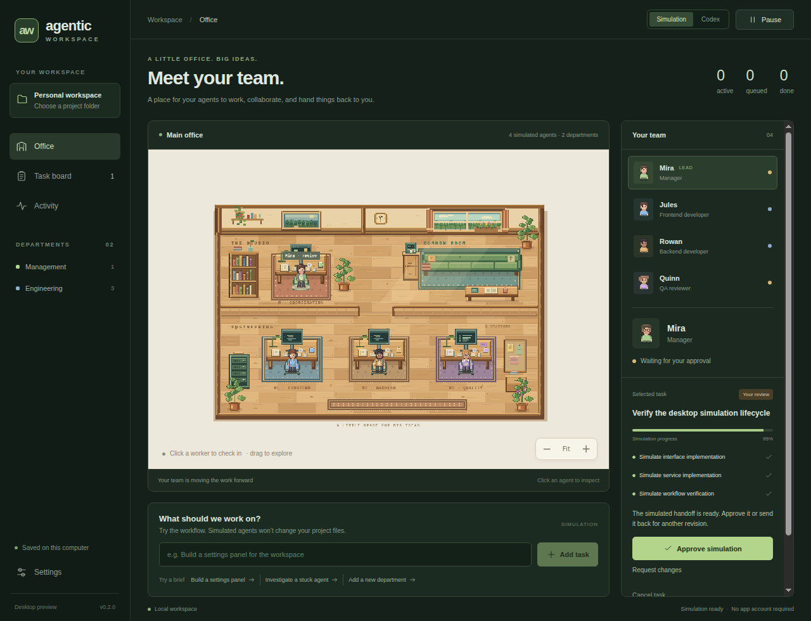
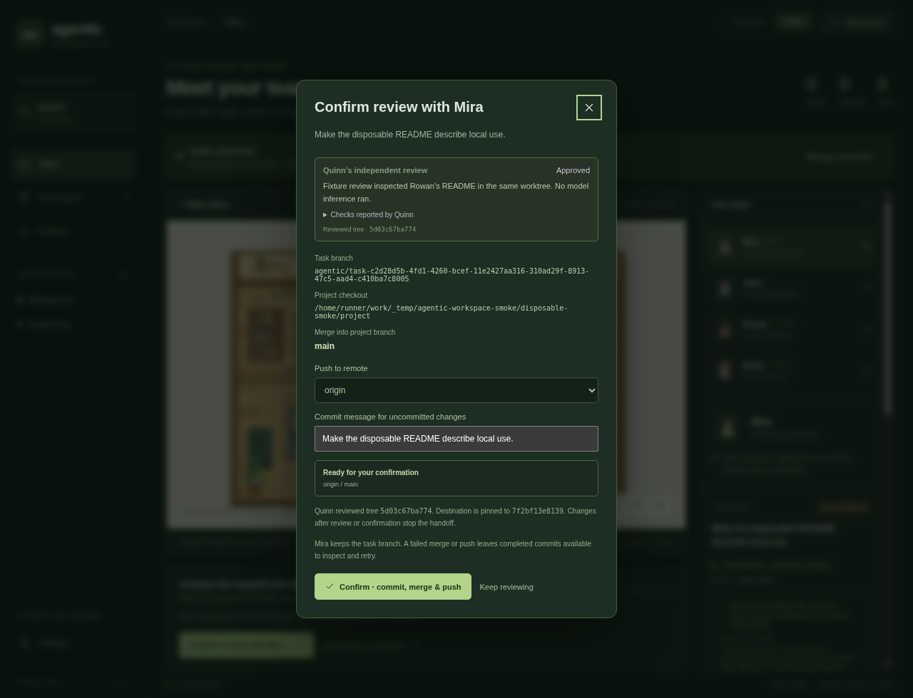

# Agentic Workspace

A standalone desktop application that represents an agent workflow as a small, animated pixel office. Electron opens its own application window; React supplies the controls and Phaser renders original, procedurally drawn artwork.



## Run locally

Install Node.js **24 or newer**, clone this repository, then run:

```sh
npm ci
npm run dev
```

This opens the desktop application directly. No application account, hosting service, API key, or browser tab is needed. Interface changes reload during development; restart the command after changing desktop or engine code.

For the production build:

```sh
npm start
```

## What works in v0.3

- An original, detailed pixel office with 32×48 character frames, textured furnishings, plants, layered lighting, four clickable agents, movement, work animations, zoom, and camera panning.
- A manager, frontend developer, backend developer, and QA reviewer.
- Task briefs and a queue. Planning releases two simulated implementation jobs; QA waits for both; the task then awaits your review.
- Approval, change requests, cancellation, pause/resume, a task board, and an activity feed.
- Native project folder selection. Simulation never reads or changes the selected project's files.
- Local task history and progress, saved atomically in Electron's application-data directory. In-progress work reopens paused.
- An isolated desktop renderer and a narrow, validated IPC bridge.
- A live Codex developer (Rowan) and an independent, read-only reviewer (Quinn), with streamed messages, tool output, model selection, explicit developer approvals, interruption, and revisions in Rowan’s original thread.
- One Git branch and isolated worktree per live task, shared by implementation and review, plus a diff inspector and native folder opener. Branches and files remain available after cancellation or review.
- Mira’s explicit commit, merge, and push confirmation, bound to Quinn’s reviewed files, with retained commits and recovery after conflicts, push failures, or interruption.

**Simulation mode** remains available without Codex or authentication. Its worker messages, verification, and progress percentages are demonstrations. **Codex mode** runs Rowan’s implementation and Quinn’s review in separate Codex threads. Mira is a workflow coordinator that performs the confirmed Git actions; the frontend role remains idle. Structured manager planning and concurrent implementation workers are future work. Live tasks use phase labels rather than invented progress percentages.

There is no app account. Live inference uses your existing Codex CLI with ChatGPT authentication and that account's usage allowance. API-key and other billing modes are disabled in this milestone.

## Use a live Codex worker

Install Git **2.38 or newer** and the Codex CLI. The adapter is checked against Codex **0.160.0**:

```sh
npm install -g @openai/codex@0.160.0
codex login
```

If your CLI is already signed in with ChatGPT, reuse that sign-in. The app never reads or copies authentication files. Open the desktop app, select **Codex** in the top bar, choose a Git repository with at least one commit, then **Connect Codex**. Settings lets you select the executable if it is absent from the app's PATH, and choose a model from the actual connected catalog. On Windows, use the native `codex.exe` when an npm command shim cannot launch directly.

Submit a task and release **Hold queue**. Each task starts from committed HEAD in a separate worktree under the app's local data directory. Uncommitted files and ignored dependencies in your original checkout are not copied. Project selection cannot retarget already queued live tasks.

Codex runs with workspace-write isolation and network access disabled by default. Requested command/file approvals appear in the inspector. Approve or decline them explicitly. Unsupported interactions are declined and recorded in Activity.

When Rowan finishes, Mira automatically hands the **same task and worktree** to Quinn. Quinn uses a fresh, read-only Codex thread, inspects the actual files and diff, and returns a structured verdict with findings and reported checks. Reviews that fail, request changes, or become stale cannot authorize publication. Quinn cannot approve requests to escape the read-only sandbox; checks requiring writes may be unavailable and must be reported honestly.

After Quinn approves, select **Confirm review with Mira…**, choose an existing Git remote and commit message, then **Prepare Git handoff**. Inspect the task branch, destination branch, and review shown in the dialog. **Confirm · commit, merge & push** commits the reviewed tree, merges it into the branch checked out in the original project folder, and pushes that pinned commit. The project checkout must be clean for a new merge. Existing task commits are retained. Git uses your existing identity and credentials; the app adds no account or sign-in for Git. Protected branches and remote rejection are surfaced as errors.

Selecting Quinn or Mira acts on the **selected existing task**. It does not create a new implementation worktree. **Request changes** returns the task to Rowan’s original thread and worktree, clears the old review, and starts a fresh Quinn review when Rowan finishes. **Finish task · keep changes local** completes the task without publishing. **Interrupt** preserves edits. Hold queue stops new tasks; the current implementation and its review continue. Restart disconnects Codex and holds the queue; unfinished model turns require explicit resume or review. A saved, approved review can be published explicitly without reconnecting Codex.

Confirmation stops if reviewed files, the target branch, target commit, or remote destination changed. A conflict leaves the original checkout untouched and retains Rowan’s commit; resolve the task branch and ask Quinn to review again. A failed push retains the local merge. **Resume Git handoff with Mira** retries its exact commit without including later unreviewed changes. Interrupted Git handoffs never push automatically on restart. The app never force-pushes, stashes, resets, fetches automatically, or removes task branches.



Worktrees are intentionally retained. Reset clears the selected mode's task history, including its worktree links, while leaving Git branches and folders on disk. Copy any paths you need before clearing live history. You can also open the retained worktree and use your normal Git or pull request workflow.

## Verify

```sh
npm run check
npm run smoke
```

`check` runs TypeScript, simulation, persistence, protocol fixtures, independent review validation, real-Git publication and recovery, and runtime lifecycle checks, followed by the production build. These automated tests never spend model usage. `smoke` boots the desktop app and checks its renderer, pixel canvas, IPC bridge, disconnected controls, simulation lifecycle, and Mira’s actual confirmation UI. A clearly labeled Codex fixture edits and reviews a disposable repository; real Git commits, merges, and pushes to a temporary local bare remote. It never calls a model or publishes to a user remote. Run `npm run build` first if using `smoke` separately. Linux environments without a display can use `xvfb-run -a npm run smoke`; the CI workflow demonstrates this setup.

The v0.3 implementation has 107 automated checks, TypeScript validation, and a production build. The Linux Electron smoke check passes the actual confirmation flow with independent review fixtures and a real commit, merge, and push to a disposable remote. The preview above was captured from that Electron window. Actual Codex authentication and model discovery were verified against 0.160.0; end-to-end live inference and model review remain unverified because thread startup stalled in this managed development environment. Review orchestration is verified with protocol fixtures, and publication with real disposable Git repositories.

## Package

```sh
npm run package
```

Electron Builder creates an installer for the current operating system in `release/`. Build macOS releases on macOS and Windows releases on Windows. These are unsigned development packages; signing, notarization, and release publishing are future work. The initial implementation is tested on Linux, not yet on physical macOS or Windows machines.

## Codex Cloud

The cloud environment is a development workspace for this repository. Use `bash scripts/cloud-setup.sh` to install dependencies and check the code. It does not host the users' desktop apps.

Read [AGENTS.md](AGENTS.md) before making changes. [Architecture](docs/architecture.md) describes the current boundaries; [roadmap](docs/roadmap.md) outlines the real Codex adapter and worktree milestones.

## Repository map

```text
src/desktop/        Electron lifecycle, preload, IPC, local persistence
src/core/           Deterministic simulated workflow engine
src/shared/         Serializable state and desktop bridge contracts
src/renderer/       React interface and original Phaser artwork
tests/              Workflow, persistence, Codex protocol, Git, and runtime verification
scripts/            Build, launch, and cloud environment setup
```

All pixel art is defined in `src/renderer/world/office-art.ts` and `character-art.ts`, and animated by `OfficeWorld.tsx`. No third-party character sheets or office artwork are included. A project license has not been selected yet.
